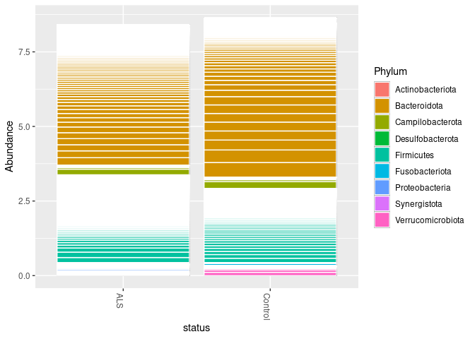

Microbiome of Amyotrophic Lateral Sclerosis (ALS) using 16S rRNA
================

-   [Introduction](#introduction)
-   [Setting up](#setting-up)
    -   [Direcotry Structure](#direcotry-structure)
    -   [Installing and Loading
        Packages](#installing-and-loading-packages)
    -   [Loading Meta and Sequence
        Data](#loading-meta-and-sequence-data)
-   [Quality Control](#quality-control)
    -   [Quality Profiles](#quality-profiles)
    -   [Filtering and Trimming](#filtering-and-trimming)
-   [Sample Composition](#sample-composition)
    -   [Learn Error Rates](#learn-error-rates)
    -   [Sample Inference](#sample-inference)
    -   [Merge Paired Reads](#merge-paired-reads)
-   [Construct sequence table](#construct-sequence-table)
-   [Remove chimeras](#remove-chimeras)
-   [Track reads through the
    pipeline](#track-reads-through-the-pipeline)
-   [Taxonomic Classification](#taxonomic-classification)
    -   [Assign taxonomy](#assign-taxonomy)
-   [Handoff to phyloseq](#handoff-to-phyloseq)
    -   [Import into phyloseq:](#import-into-phyloseq)
    -   [Bar plot](#bar-plot)

<div align="center">


</div>

<div align="right">

<small>*Stephen Hawking*. Photo Credit: [NASA/Paul E.
Alers](https://flic.kr/p/6h1t6B).</small>

</div>

## Introduction

Amyotrophic lateral sclerosis
([ALS](https://en.wikipedia.org/wiki/Amyotrophic_lateral_sclerosis)) is
a neurodegenerative neuromuscular disease that results in the
progressive loss of motor neurons that control voluntary muscles. About
20 genes are associated with ALS, most importantly
[C9orf72](https://en.wikipedia.org/wiki/C9orf72), which accounts for
about 40% of the cases. In addition to genetic risk, environmental
factors such as smoking and physical activity represent potential risks.
Among the environmental factors is the gut microbiota, which has been
shown to contribute and affect mental health, leading to the emerging
paradigm of the [gut-brain
axis](https://en.wikipedia.org/wiki/Gut%E2%80%93brain_axis)
([GBA](https://en.wikipedia.org/wiki/Gut%E2%80%93brain_axis)).
Therefore, [Hertzberg et
al. 2021](https://pubmed.ncbi.nlm.nih.gov/33818222/) examined the gut
microbiome profiles between ALS patients and their corresponding health
caregivers using 16S rRNA.

In this lesson, we are going to reanalyze the generated from this study.
The NCBI BioProject accession number is
[PRJNA566436](https://www.ncbi.nlm.nih.gov/bioproject/PRJNA566436),
composed of 9 ALS patients and corresponding healthy controls (i.e., a
total of 18 samples).

The processing of the 16S data will be performed using
[DADA2](https://github.com/benjjneb/dada2), implemented in the
[Bioconductor](https://www.bioconductor.org/) package
[`dada2`](https://www.bioconductor.org/packages/release/bioc/html/dada2.html)
([Callahan et al. 2016](https://pubmed.ncbi.nlm.nih.gov/27214047/)).
DADA2 primarily models and corrects
[Illumina](https://www.illumina.com/) amplicon sequencing errors (it can
handle data generated by other next-generation sequencing (NGS)
platforms as well, including [Ion
Torrent](https://www.thermofisher.com/eg/en/home/brands/ion-torrent.html)
and [454](https://en.wikipedia.org/wiki/454_Life_Sciences)). Most of the
subsequent steps are based on the [DADA2
tutorial](https://benjjneb.github.io/dada2/tutorial.html).

## Setting up

### Direcotry Structure

In the working directory, there is a file called `samples.tsv` with a
list of the samples and the status (`ALS` vs `Control`) of each sample.
The dataset in **paired-end** FASTQ (compressed `.fastq.gz`) is located
under `data/original/`. There is also the `data/silva/` folder with the
[SILVA](https://www.arb-silva.de/) database for taxonomic
classification.

### Installing and Loading Packages

The main package required for this lesson is
[`dada2`](https://doi.org/doi:10.18129/B9.bioc.dada2). If it is not
installed already, it can installed through
[`BiocManager`](https://cran.r-project.org/web/packages/BiocManager/vignettes/BiocManager.html)
as follows:

``` r
if (!requireNamespace("BiocManager", quietly = TRUE))
  install.packages("BiocManager")
BiocManager::install("dada2")
```

The main package required for this lesson is
[`phyloseq`](https://doi.org/doi:10.18129/B9.bioc.phyloseq). If it is
not installed already, it can installed through
[`BiocManager`](https://cran.r-project.org/web/packages/BiocManager/vignettes/BiocManager.html)
as follows:

``` r
if (!requireNamespace("BiocManager", quietly = TRUE))
  install.packages("BiocManager")
BiocManager::install("phyloseq")
```

Additional, [`tidyverse`](https://www.tidyverse.org/) will be required
for data reading, handling, and plotting. Finally,
[`digest`](https://cran.r-project.org/web/packages/digest/index.html)
will be required for only prettify the names of the operational
taxonomic units (OTUs). Both packages can be installed from the The
Comprehensive R Archive Network (CRAN) repository as follows:

``` r
install.packages(c("tidyverse", "digest"))
```

After all the required packages are successfully installed, typically
happens once per `R` installation, let us **load** these package in the
current `R` session (workspace):

``` r
library(dada2)
```

    ## Loading required package: Rcpp

``` r
library(phyloseq)
library(tidyverse)
```

    ## ── Attaching packages ─────────────────────────────────────── tidyverse 1.3.1 ──

    ## ✓ ggplot2 3.3.3     ✓ purrr   0.3.4
    ## ✓ tibble  3.1.2     ✓ dplyr   1.0.6
    ## ✓ tidyr   1.1.3     ✓ stringr 1.4.0
    ## ✓ readr   1.4.0     ✓ forcats 0.5.1

    ## ── Conflicts ────────────────────────────────────────── tidyverse_conflicts() ──
    ## x dplyr::filter() masks stats::filter()
    ## x dplyr::lag()    masks stats::lag()

``` r
library(digest)
```

### Loading Meta and Sequence Data

In loading the samples information (metadata), `read_tsv`’s parameter
`col_types` takes the `cff` to indicate that the first column in a
*character* (string) but the second and third columns are *factor*
(categorical) - for more on data types in R, see the episode on [Data
Types and
Structures](https://swcarpentry.github.io/r-novice-inflammation/13-supp-data-structures/)

``` r
samples = read_tsv("data/samples.tsv", col_types = 'cff')
glimpse(samples)
```

    ## Rows: 18
    ## Columns: 3
    ## $ sample <chr> "SRR10153501", "SRR10153511", "SRR10153503", "SRR10153499", "SR…
    ## $ status <fct> ALS, Control, ALS, Control, ALS, Control, ALS, Control, ALS, Co…
    ## $ pair   <fct> 1, 1, 2, 2, 3, 3, 5, 5, 6, 6, 7, 7, 8, 8, 9, 9, 10, 10

`glimpse` shows that there are 18 rows (samples) and the three columns
are `sample`, `status`, and `pair` were loaded successfully as `chr`,
`fct`, and `fct`, respectively.

Now let’s start processing the FASTQ files. First, we will list all the
files in the `original` subfolder.

``` r
path = "data/original"
list.files(path)
```

    ##  [1] "SRR10153499_1.fastq.gz" "SRR10153499_2.fastq.gz" "SRR10153500_1.fastq.gz"
    ##  [4] "SRR10153500_2.fastq.gz" "SRR10153501_1.fastq.gz" "SRR10153501_2.fastq.gz"
    ##  [7] "SRR10153502_1.fastq.gz" "SRR10153502_2.fastq.gz" "SRR10153503_1.fastq.gz"
    ## [10] "SRR10153503_2.fastq.gz" "SRR10153504_1.fastq.gz" "SRR10153504_2.fastq.gz"
    ## [13] "SRR10153505_1.fastq.gz" "SRR10153505_2.fastq.gz" "SRR10153506_1.fastq.gz"
    ## [16] "SRR10153506_2.fastq.gz" "SRR10153507_1.fastq.gz" "SRR10153507_2.fastq.gz"
    ## [19] "SRR10153508_1.fastq.gz" "SRR10153508_2.fastq.gz" "SRR10153509_1.fastq.gz"
    ## [22] "SRR10153509_2.fastq.gz" "SRR10153510_1.fastq.gz" "SRR10153510_2.fastq.gz"
    ## [25] "SRR10153511_1.fastq.gz" "SRR10153511_2.fastq.gz" "SRR10153512_1.fastq.gz"
    ## [28] "SRR10153512_2.fastq.gz" "SRR10153513_1.fastq.gz" "SRR10153513_2.fastq.gz"
    ## [31] "SRR10153514_1.fastq.gz" "SRR10153514_2.fastq.gz" "SRR10153515_1.fastq.gz"
    ## [34] "SRR10153515_2.fastq.gz" "SRR10153573_1.fastq.gz" "SRR10153573_2.fastq.gz"

The above list will be split into forward and reverse reads, according
to the FASTQ file name where file names that end with `1.fastq.gz` are
the forward reads and file names that end with `2.fastq.gz` are the
reverse reads.

**The forward reads:**

``` r
forward.original = sort(list.files(path, pattern="1.fastq.gz", full.names = TRUE))
head(forward.original)
```

    ## [1] "data/original/SRR10153499_1.fastq.gz"
    ## [2] "data/original/SRR10153500_1.fastq.gz"
    ## [3] "data/original/SRR10153501_1.fastq.gz"
    ## [4] "data/original/SRR10153502_1.fastq.gz"
    ## [5] "data/original/SRR10153503_1.fastq.gz"
    ## [6] "data/original/SRR10153504_1.fastq.gz"

**The reverse reads:**

``` r
reverse.original = sort(list.files(path, pattern="2.fastq.gz", full.names = TRUE))
head(reverse.original)
```

    ## [1] "data/original/SRR10153499_2.fastq.gz"
    ## [2] "data/original/SRR10153500_2.fastq.gz"
    ## [3] "data/original/SRR10153501_2.fastq.gz"
    ## [4] "data/original/SRR10153502_2.fastq.gz"
    ## [5] "data/original/SRR10153503_2.fastq.gz"
    ## [6] "data/original/SRR10153504_2.fastq.gz"

The sample name is extracted from the FASTQ file name using
[`strsplit`](https://www.rdocumentation.org/packages/base/versions/3.6.2/topics/strsplit)
by searching and taking the part the file name before the underscore
`_`. The extracted sample name should match the `sample` column (first
column) in the metadata loaded above. With
[`sapply`](https://www.rdocumentation.org/packages/base/versions/3.6.2/topics/lapply),
the extraction (`strsplit`) is applied on the list (vector) of names in
`forward.original`.

``` r
sample.names = sapply(strsplit(basename(forward.original), "_"), `[`, 1)
head(sample.names)
```

    ## [1] "SRR10153499" "SRR10153500" "SRR10153501" "SRR10153502" "SRR10153503"
    ## [6] "SRR10153504"

## Quality Control

### Quality Profiles

#### Forward Reads

We will plot (using
[`plotQualityProfile`](https://rdrr.io/bioc/dada2/man/plotQualityProfile.html))
the quality profile of *forward* reads in the first two samples

``` r
plotQualityProfile(forward.original[1:2])
```

<!-- -->

#### Reverse Reads

Then the quality profile of *reverse* reads of the same first two
samples above

``` r
plotQualityProfile(reverse.original[1:2])
```

<!-- -->

As expected, the forward reads are typically of higher quality for most
of the read length, but for the reverse read, the quality drops about
half-way through the read length (starting approximately from the 100th
nucleotide)

### Filtering and Trimming

Here, only defining the names (`.1.filtered.fastq.gz` and
`.2.filtered.fastq.gz` for the *forward* and *reverse* reads,
respectively) and destination subfolder `data/filtered` of the filtered
FASTQ files. The sample name `sample.names` will be assigned to the row
name of the `data.frame`:

``` r
forward.filtered = file.path("data/filtered", paste0(sample.names, ".1.filtered.fastq.gz"))
reverse.filtered = file.path("data/filtered", paste0(sample.names, ".2.filtered.fastq.gz"))

names(forward.filtered) = sample.names
names(reverse.filtered) = sample.names
```

Now filter and trim using
[`filterAndTrim`](https://rdrr.io/bioc/dada2/man/filterAndTrim.html),
which takes input FASTQ files and generates the corresponding output
FASTQ files.

``` r
out = filterAndTrim(forward.original, forward.filtered, 
                    reverse.original, reverse.filtered,
                    minLen = 150, # Pretty stringent but to show difference between the in and out
                    multithread = TRUE) # In case of Windows OS, multithread should be FALSE (which is the default)
head(out)
```

|                         | reads.in | reads.out |
|:------------------------|---------:|----------:|
| SRR10153499\_1.fastq.gz |    11688 |      9907 |
| SRR10153500\_1.fastq.gz |    15828 |     11295 |
| SRR10153501\_1.fastq.gz |    14180 |     11437 |
| SRR10153502\_1.fastq.gz |    10482 |      8965 |
| SRR10153503\_1.fastq.gz |    13782 |     11345 |
| SRR10153504\_1.fastq.gz |    14467 |     11425 |

## Sample Composition

Now it comes to the nuts and bolts of using **DADA2** in infer sample
compsition

### Learn Error Rates

**DADA2** uses of a parametric error model per every amplicon dataset.
The error learning process is performed by
[`learnErrors`](https://rdrr.io/bioc/dada2/man/learnErrors.html) from
the *data*. The approach is to alternate the estimation of the error
rates and the inference of sample composition until the two converge.

#### Forward Reads Errors

``` r
forward.errors = learnErrors(forward.filtered, multithread = TRUE)
```

    ## 45461505 total bases in 190008 reads from 18 samples will be used for learning the error rates.

``` r
plotErrors(forward.errors, nominalQ = TRUE) # Plot observed frequency of each transition
```

<!-- -->

#### Reverse Reads Errors

``` r
reverse.errors = learnErrors(reverse.filtered, multithread = TRUE)
```

    ## 39575151 total bases in 190008 reads from 18 samples will be used for learning the error rates.

``` r
plotErrors(reverse.errors, nominalQ = TRUE) # Plot observed frequency of each transition
```

<!-- -->

### Sample Inference

Now it is time to apply the sample inference algorithm, not surprisingly
the main method is called
[`dada`](https://rdrr.io/bioc/dada2/man/dada.html) :wink: This method
removes all estimated errors from the filtered sequence reads and
estimates the composition of each sample.

#### Forward Sample Inference

``` r
forward.dada = dada(forward.filtered, err = forward.errors, multithread = TRUE)
```

    ## Sample 1 - 9907 reads in 4306 unique sequences.
    ## Sample 2 - 11295 reads in 6598 unique sequences.
    ## Sample 3 - 11437 reads in 6130 unique sequences.
    ## Sample 4 - 8965 reads in 4869 unique sequences.
    ## Sample 5 - 11345 reads in 5462 unique sequences.
    ## Sample 6 - 11425 reads in 6348 unique sequences.
    ## Sample 7 - 11111 reads in 5274 unique sequences.
    ## Sample 8 - 12067 reads in 5961 unique sequences.
    ## Sample 9 - 9883 reads in 5960 unique sequences.
    ## Sample 10 - 9563 reads in 4130 unique sequences.
    ## Sample 11 - 10508 reads in 5357 unique sequences.
    ## Sample 12 - 11592 reads in 6122 unique sequences.
    ## Sample 13 - 8911 reads in 4174 unique sequences.
    ## Sample 14 - 10840 reads in 4331 unique sequences.
    ## Sample 15 - 9624 reads in 6037 unique sequences.
    ## Sample 16 - 9088 reads in 4960 unique sequences.
    ## Sample 17 - 10429 reads in 3865 unique sequences.
    ## Sample 18 - 12018 reads in 5879 unique sequences.

``` r
head(forward.dada)
```

    ## $SRR10153499
    ## dada-class: object describing DADA2 denoising results
    ## 63 sequence variants were inferred from 4306 input unique sequences.
    ## Key parameters: OMEGA_A = 1e-40, OMEGA_C = 1e-40, BAND_SIZE = 16
    ## 
    ## $SRR10153500
    ## dada-class: object describing DADA2 denoising results
    ## 124 sequence variants were inferred from 6598 input unique sequences.
    ## Key parameters: OMEGA_A = 1e-40, OMEGA_C = 1e-40, BAND_SIZE = 16
    ## 
    ## $SRR10153501
    ## dada-class: object describing DADA2 denoising results
    ## 94 sequence variants were inferred from 6130 input unique sequences.
    ## Key parameters: OMEGA_A = 1e-40, OMEGA_C = 1e-40, BAND_SIZE = 16
    ## 
    ## $SRR10153502
    ## dada-class: object describing DADA2 denoising results
    ## 78 sequence variants were inferred from 4869 input unique sequences.
    ## Key parameters: OMEGA_A = 1e-40, OMEGA_C = 1e-40, BAND_SIZE = 16
    ## 
    ## $SRR10153503
    ## dada-class: object describing DADA2 denoising results
    ## 78 sequence variants were inferred from 5462 input unique sequences.
    ## Key parameters: OMEGA_A = 1e-40, OMEGA_C = 1e-40, BAND_SIZE = 16
    ## 
    ## $SRR10153504
    ## dada-class: object describing DADA2 denoising results
    ## 102 sequence variants were inferred from 6348 input unique sequences.
    ## Key parameters: OMEGA_A = 1e-40, OMEGA_C = 1e-40, BAND_SIZE = 16

#### Reverse Sample Inference

``` r
reverse.dada = dada(reverse.filtered, err = reverse.errors, multithread = TRUE)
```

    ## Sample 1 - 9907 reads in 6084 unique sequences.
    ## Sample 2 - 11295 reads in 8328 unique sequences.
    ## Sample 3 - 11437 reads in 8002 unique sequences.
    ## Sample 4 - 8965 reads in 6397 unique sequences.
    ## Sample 5 - 11345 reads in 7343 unique sequences.
    ## Sample 6 - 11425 reads in 7901 unique sequences.
    ## Sample 7 - 11111 reads in 6943 unique sequences.
    ## Sample 8 - 12067 reads in 7889 unique sequences.
    ## Sample 9 - 9883 reads in 7295 unique sequences.
    ## Sample 10 - 9563 reads in 5886 unique sequences.
    ## Sample 11 - 10508 reads in 7123 unique sequences.
    ## Sample 12 - 11592 reads in 8244 unique sequences.
    ## Sample 13 - 8911 reads in 5942 unique sequences.
    ## Sample 14 - 10840 reads in 5829 unique sequences.
    ## Sample 15 - 9624 reads in 7704 unique sequences.
    ## Sample 16 - 9088 reads in 6444 unique sequences.
    ## Sample 17 - 10429 reads in 5279 unique sequences.
    ## Sample 18 - 12018 reads in 7587 unique sequences.

``` r
head(reverse.dada)
```

    ## $SRR10153499
    ## dada-class: object describing DADA2 denoising results
    ## 36 sequence variants were inferred from 6084 input unique sequences.
    ## Key parameters: OMEGA_A = 1e-40, OMEGA_C = 1e-40, BAND_SIZE = 16
    ## 
    ## $SRR10153500
    ## dada-class: object describing DADA2 denoising results
    ## 70 sequence variants were inferred from 8328 input unique sequences.
    ## Key parameters: OMEGA_A = 1e-40, OMEGA_C = 1e-40, BAND_SIZE = 16
    ## 
    ## $SRR10153501
    ## dada-class: object describing DADA2 denoising results
    ## 65 sequence variants were inferred from 8002 input unique sequences.
    ## Key parameters: OMEGA_A = 1e-40, OMEGA_C = 1e-40, BAND_SIZE = 16
    ## 
    ## $SRR10153502
    ## dada-class: object describing DADA2 denoising results
    ## 33 sequence variants were inferred from 6397 input unique sequences.
    ## Key parameters: OMEGA_A = 1e-40, OMEGA_C = 1e-40, BAND_SIZE = 16
    ## 
    ## $SRR10153503
    ## dada-class: object describing DADA2 denoising results
    ## 43 sequence variants were inferred from 7343 input unique sequences.
    ## Key parameters: OMEGA_A = 1e-40, OMEGA_C = 1e-40, BAND_SIZE = 16
    ## 
    ## $SRR10153504
    ## dada-class: object describing DADA2 denoising results
    ## 58 sequence variants were inferred from 7901 input unique sequences.
    ## Key parameters: OMEGA_A = 1e-40, OMEGA_C = 1e-40, BAND_SIZE = 16

### Merge Paired Reads

Now the denoised forward and reverse mates of the paired-end reads are
merged into full sequences using
[`mergePairs`](https://rdrr.io/bioc/dada2/man/mergePairs.html). To
merge, the reverse read is *reverse complemented* and aligned to the
forward read. And paired reads that do not overlap exactly are removed
from the merged output.

``` r
mergers = mergePairs(forward.dada, forward.filtered, reverse.dada, reverse.filtered, verbose = TRUE)
```

    ## 8188 paired-reads (in 34 unique pairings) successfully merged out of 9583 (in 101 pairings) input.

    ## Duplicate sequences in merged output.

    ## 8454 paired-reads (in 59 unique pairings) successfully merged out of 10536 (in 246 pairings) input.

    ## Duplicate sequences in merged output.

    ## 9263 paired-reads (in 58 unique pairings) successfully merged out of 11048 (in 192 pairings) input.

    ## 6208 paired-reads (in 30 unique pairings) successfully merged out of 8471 (in 214 pairings) input.

    ## 8025 paired-reads (in 34 unique pairings) successfully merged out of 10896 (in 153 pairings) input.

    ## 9086 paired-reads (in 52 unique pairings) successfully merged out of 10891 (in 199 pairings) input.

    ## Duplicate sequences in merged output.

    ## 8073 paired-reads (in 35 unique pairings) successfully merged out of 10613 (in 207 pairings) input.

    ## Duplicate sequences in merged output.

    ## 9942 paired-reads (in 42 unique pairings) successfully merged out of 11661 (in 153 pairings) input.

    ## 6890 paired-reads (in 39 unique pairings) successfully merged out of 9242 (in 243 pairings) input.

    ## 8307 paired-reads (in 34 unique pairings) successfully merged out of 9231 (in 113 pairings) input.

    ## Duplicate sequences in merged output.

    ## 8333 paired-reads (in 50 unique pairings) successfully merged out of 9927 (in 199 pairings) input.

    ## 9652 paired-reads (in 54 unique pairings) successfully merged out of 10969 (in 185 pairings) input.

    ## 7437 paired-reads (in 27 unique pairings) successfully merged out of 8526 (in 118 pairings) input.

    ## 9990 paired-reads (in 30 unique pairings) successfully merged out of 10656 (in 82 pairings) input.

    ## 6714 paired-reads (in 61 unique pairings) successfully merged out of 8721 (in 248 pairings) input.

    ## 6509 paired-reads (in 32 unique pairings) successfully merged out of 8627 (in 147 pairings) input.

    ## Duplicate sequences in merged output.

    ## 8878 paired-reads (in 19 unique pairings) successfully merged out of 10278 (in 79 pairings) input.

    ## 9486 paired-reads (in 34 unique pairings) successfully merged out of 11590 (in 136 pairings) input.

    ## Duplicate sequences in merged output.

``` r
head(mergers[[1]]) # Inspect the merger data.frame of the first sample
```

| sequence                                                                                                                                                                                                                                                      | abundance | forward | reverse | nmatch | nmismatch | nindel | prefer | accept |
|:--------------------------------------------------------------------------------------------------------------------------------------------------------------------------------------------------------------------------------------------------------------|----------:|--------:|--------:|-------:|----------:|-------:|-------:|:-------|
| TACGGAAGGTCCGGGCGTTATCCGGATTTATTGGGTTTAAAGGGAGCGTAGGCTGTCTATTAAGCGTGTTGTGAAATTTACCGGCTCAACCGGTGGCTTGCAGCGCGAACTGGTCGACTTGAGTATGCAGGAAGTAGGCGGAATTCATGGTGTAGCGGTGAAATGCTTAGATATCATGACGAACTCCGATTGCGCAGGCAGCTTACTGTAGCATAACTGACGCTGATGCTCGAAAGTGCGGGTATCAAACAGG |      2368 |       1 |       1 |    247 |         0 |      0 |      1 | TRUE   |
| TACGGAAGGTTCGGGCGTTATCCGGATTTATTGGGTTTAAAGGGAGCGTAGGCCGTTTGGTAAGCGTGTTGTGAAATGTAGGAGCTCAACTTCTAGATTGCAGCGCGAACTGTCAGACTTGAGTGCGCACAACGTAGGCGGAATTCATGGTGTAGCGGTGAAATGCTTAGATATCATGAAGAACTCCGATTGCGAAGGCAGCTTACGGGAGCGCAACTGACGCTGAAGCTCGAAGGTGCGGGTATCGAACAGG |       916 |       3 |       2 |    247 |         0 |      0 |      1 | TRUE   |
| TACAGAGGTCTCAAGCGTTGTTCGGAATCACTGGGCGTAAAGCGTGCGTAGGCTGTTTCGTAAGTCGTGTGTGAAAGGCGCGGGCTCAACCCGCGGACGGCACATGATACTGCGAGACTAGAGTAATGGAGGGGGAACCGGAATTCTCGGTGTAGCAGTGAAATGCGTAGATATCGAGAGGAACACTCGTGGCGAAGGCGGGTTCCTGGACATTAACTGACGCTGAGGCACGAAGGCCAGGGGAGCGAAAGGG |       906 |       2 |       3 |    193 |         0 |      0 |      2 | TRUE   |
| TACGGAAGGTTCGGGCGTTATCCGGATTTATTGGGTTTAAAGGGAGCGTAGGCCGTTTGGTAAGCGTGTTGTGAAATGTAGTAGCTCAACTTCTAGATTGCAGCGCGAACTGTCAGACTTGAGTGCGCACAACGTAGGCGGAATTCATGGTGTAGCGGTGAAATGCTTAGATATCATGAAGAACTCCGATTGCGAAGGCAGCTTACGGGAGCGCAACTGACGCTGAAGCTCGAAGGTGCGGGTATCGAACAGG |       665 |       4 |      31 |    247 |         0 |      0 |      1 | TRUE   |
| TACGGAAGGTCCGGGCGTTATCCGGATTTATTGGGTTTAAAGGGAGCGTAGGCTGTCTATTAAGCGTGTTGTGAAATATACCGGCTCAACCGGTGGCTTGCAGCGCGAACTGGTCGACTTGAGTATGCAGGAAGTAGGCGGAATTCATGGTGTAGCGGTGAAATGCTTAGATATCATGACGAACTCCGATTGCGCAGGCAGCTTACTGTAGCATAACTGACGCTGATGCTCGAAAGTGCGGGTATCAAACAGG |       435 |      10 |      33 |    247 |         0 |      0 |      1 | TRUE   |
| TACGTATGGAGCGAGCGTTGTCCGGAATTATTGGGCGTAAAGGGTACGCAGGCGGTTTAATAAGTCGAATGTTAAAGATCGGGGCTCAACCCCGTAAAGCATTGGAAACTGATAAACTTGAGTAGTGGAGAGGAAAGTGGAATTCCTAGTGTAGTGGTGAAATACGTAGATATTAGGAGGAATACCAGTAGCGAAGGCGACTTTCTGGACACAAACTGACGCTGAGGTACGAAAGCGTGGGGAGCAAACAGG  |       404 |       5 |       5 |    250 |         0 |      0 |      2 | TRUE   |

*From the documentation of the method*:

The return `data.frame`(s) has a row for each unique pairing of
forward/reverse denoised sequences, and the following columns:

-   `$abundance`: Number of reads corresponding to this forward/reverse
    combination.
-   `$sequence`: The merged sequence.
-   `$forward`: The index of the forward denoised sequence.
-   `$reverse`: The index of the reverse denoised sequence.
-   `$nmatch`: Number of matches nts in the overlap region.
-   `$nmismatch`: Number of mismatches in the overlap region.
-   `$nindel`: Number of indels in the overlap region.
-   `$prefer`: The sequence used for the overlap region. 1=forward;
    2=reverse.
-   `$accept`: `TRUE` if overlap between forward and reverse denoised
    sequences was at least `minOverlap` and had at most `maxMismatch`
    differences. `FALSE` otherwise.

## Construct sequence table

We can now construct an amplicon sequence variant table (ASV) table, a
higher-resolution version of the OTU table produced by traditional
methods.

``` r
seqtab = makeSequenceTable(mergers)
```

    ## Duplicate sequences detected and merged.
    ## Duplicate sequences detected and merged.
    ## Duplicate sequences detected and merged.
    ## Duplicate sequences detected and merged.
    ## Duplicate sequences detected and merged.
    ## Duplicate sequences detected and merged.
    ## Duplicate sequences detected and merged.

``` r
dim(seqtab)
```

    ## [1]  18 293

``` r
# Inspect distribution of sequence lengths
table(nchar(getSequences(seqtab)))
```

| 252 | 253 | 254 |
|----:|----:|----:|
|  56 | 229 |   8 |

The sequence table is a `matrix` with rows corresponding to (and named
by) the samples, and columns corresponding to (and named by) the
sequence variants. This table contains 293 ASVs, and the lengths of our
merged sequences all fall within the expected range for this V4
amplicon.

*Considerations for your own data:* Sequences that are much longer or
shorter than expected may be the result of non-specific priming. You can
remove non-target-length sequences from your sequence table (eg.
`seqtab2 = seqtab[,nchar(colnames(seqtab)) %in% 250:256]`). This is
analogous to “cutting a band” in-silico to get amplicons of the targeted
length.

## Remove chimeras

The core `dada` method corrects substitution and indel errors, but
chimeras remain. Fortunately, the accuracy of sequence variants after
denoising makes identifying chimeric ASVs simpler than when dealing with
fuzzy OTUs. Chimeric sequences are identified if they can be exactly
reconstructed by combining a left-segment and a right-segment from two
more abundant “parent” sequences.

``` r
seqtab.nochim = removeBimeraDenovo(seqtab, method="consensus", multithread=TRUE, verbose=TRUE)
```

    ## Identified 18 bimeras out of 293 input sequences.

``` r
dim(seqtab.nochim)
```

    ## [1]  18 275

``` r
sum(seqtab.nochim)/sum(seqtab)
```

    ## [1] 0.9865828

The frequency of chimeric sequences varies substantially from dataset to
dataset, and depends on on factors including experimental procedures and
sample complexity. Here chimeras make up about 21% of the merged
sequence variants, but when we account for the abundances of those
variants we see they account for only about 4% of the merged sequence
reads.

*Considerations for your own data:* Most of your reads should remain
after chimera removal (it is not uncommon for a majority of sequence
variants to be removed though). If most of your reads were removed as
chimeric, upstream processing may need to be revisited. In almost all
cases this is caused by primer sequences with ambiguous nucleotides that
were not removed prior to beginning the DADA2 pipeline.

## Track reads through the pipeline

As a final check of our progress, we’ll look at the number of reads that
made it through each step in the pipeline:

``` r
getN = function(x) sum(getUniques(x))
track = cbind(out, sapply(forward.dada, getN), sapply(reverse.dada, getN), sapply(mergers, getN), rowSums(seqtab.nochim))
```

    ## Duplicate sequences detected and merged.
    ## Duplicate sequences detected and merged.
    ## Duplicate sequences detected and merged.
    ## Duplicate sequences detected and merged.
    ## Duplicate sequences detected and merged.
    ## Duplicate sequences detected and merged.
    ## Duplicate sequences detected and merged.

``` r
# If processing a single sample, remove the sapply calls: e.g. replace sapply(forward.dada, getN) with getN(forward.dada)
colnames(track) = c("input", "filtered", "denoisedF", "denoisedR", "merged", "nonchim")
rownames(track) = sample.names
head(track)
```

|             | input | filtered | denoisedF | denoisedR | merged | nonchim |
|:------------|------:|---------:|----------:|----------:|-------:|--------:|
| SRR10153499 | 11688 |     9907 |      9688 |      9703 |   8188 |    8188 |
| SRR10153500 | 15828 |    11295 |     10847 |     10788 |   8454 |    8449 |
| SRR10153501 | 14180 |    11437 |     11191 |     11209 |   9263 |    9263 |
| SRR10153502 | 10482 |     8965 |      8671 |      8642 |   6208 |    6119 |
| SRR10153503 | 13782 |    11345 |     11079 |     11059 |   8025 |    7979 |
| SRR10153504 | 14467 |    11425 |     11104 |     11076 |   9086 |    9086 |

Looks good! We kept the majority of our raw reads, and there is no
over-large drop associated with any single step.

*Considerations for your own data:* This is a great place to do a last
**sanity check**. Outside of filtering, there should no step in which a
majority of reads are lost. If a majority of reads failed to merge, you
may need to revisit the `truncLen` parameter used in the filtering step
and make sure that the truncated reads span your amplicon. If a majority
of reads were removed as chimeric, you may need to revisit the removal
of primers, as the ambiguous nucleotides in unremoved primers interfere
with chimera identification.

# Taxonomic Classification

## Assign taxonomy

It is common at this point, especially in 16S/18S/ITS amplicon
sequencing, to assign taxonomy to the sequence variants. The DADA2
package provides a native implementation of the [naive Bayesian
classifier method](http://www.ncbi.nlm.nih.gov/pubmed/17586664) for this
purpose. The `assignTaxonomy` function takes as input a set of sequences
to be classified and a training set of reference sequences with known
taxonomy, and outputs taxonomic assignments with at least `minBoot`
bootstrap confidence.

We maintain [formatted training fastas for the RDP training set,
GreenGenes clustered at 97% identity, and the Silva reference
database](https://benjjneb.github.io/dada2/training.html), and
additional trainings fastas suitable for protists and certain specific
environments have been contributed. For fungal taxonomy, the General
Fasta release files from the [UNITE ITS
database](https://unite.ut.ee/repository.php) can be used as is. To
follow along, download the `silva_nr_v138_train_set.fa.gz` file, and
place it in the directory with the fastq files.

``` r
taxa = assignTaxonomy(seqtab.nochim, "data/silva/silva_nr99_v138_train_set.fa.gz", multithread=TRUE)
head(taxa)
```

|                                                                                                                                                                                                                                                               | Kingdom  | Phylum           | Class           | Order                               | Family             | Genus         |
|:--------------------------------------------------------------------------------------------------------------------------------------------------------------------------------------------------------------------------------------------------------------|:---------|:-----------------|:----------------|:------------------------------------|:-------------------|:--------------|
| TACGGAAGGTTCGGGCGTTATCCGGATTTATTGGGTTTAAAGGGAGCGTAGGCCGTTTGGTAAGCGTGTTGTGAAATGTAGGAGCTCAACTTCTAGATTGCAGCGCGAACTGTCAGACTTGAGTGCGCACAACGTAGGCGGAATTCATGGTGTAGCGGTGAAATGCTTAGATATCATGAAGAACTCCGATTGCGAAGGCAGCTTACGGGAGCGCAACTGACGCTGAAGCTCGAAGGTGCGGGTATCGAACAGG | Bacteria | Bacteroidota     | Bacteroidia     | Bacteroidales                       | Prevotellaceae     | Prevotella    |
| TACGGAAGGTCCGGGCGTTATCCGGATTTATTGGGTTTAAAGGGAGTGTAGGCGGCCTGTTAAGCGTGTTGTGAAATGTAGATGCTCAACATCTGAACTGCAGCGCGAACTGGCTGGCTTGAGTACACGCAACGTGGGCGGAATTCATGGTGTAGCGGTGAAATGCTTAGATATCATGAGGAACTCCTATTGCGAAGGCAGCTCACGGGAGTGTCACTGACGCTTAAGCTCGAAGGTGCGGGTATCAAACAGG | Bacteria | Bacteroidota     | Bacteroidia     | Bacteroidales                       | Prevotellaceae     | Prevotella    |
| TACGTATGGAGCGAGCGTTGTCCGGAATTATTGGGCGTAAAGGGTACGCAGGCGGTTTAATAAGTCGAATGTTAAAGATCGGGGCTCAACCCCGTAAAGCATTGGAAACTGATAAACTTGAGTAGTGGAGAGGAAAGTGGAATTCCTAGTGTAGTGGTGAAATACGTAGATATTAGGAGGAATACCAGTAGCGAAGGCGACTTTCTGGACACAAACTGACGCTGAGGTACGAAAGCGTGGGGAGCAAACAGG  | Bacteria | Firmicutes       | Clostridia      | Peptostreptococcales-Tissierellales | Finegoldia         | NA            |
| TACGGAAGGTCCAGGCGTTATCCGGATTTATTGGGTTTAAAGGGAGTGTAGGCGGTTGGTTAAGCGTGTTGTGAAATGTAGATGCTCAACATCTGACTTGCAGCGCGAACTGGCTGACTTGAGTACACACAACGTAGGCGGAATTCATGGTGTAGCGGTGAAATGCTTAGATATCATGAAGAACTCCGATTGCGAAGGCAGCTTACGGGAGTGTTACTGACGCTTAAGCTCGAAGGTGCGGGTATCGAACAGG | Bacteria | Bacteroidota     | Bacteroidia     | Bacteroidales                       | Prevotellaceae     | Prevotella    |
| TACGTAAGGGGCGAGCGTTGTCCGGAATTATTGGGCGTAAAGAGTGCGTAGGCGGCAAATTAAGTCAGATGTGAAAACTAAGGGCTCAACCCATAGATTGCATCTGAAACTGATATGCTTGAGTCAAGGAGAGGAAAGTGGAATTCCTAGTGTAGCGGTGGAATGCGTAGATATTAGGAGGAATACCGGTGGCGAAGGCGACTTTCTGGACTTGAACTGACGCTGAGGCACGAAAGCGTGGGGAGCAAACAGG | Bacteria | Firmicutes       | Clostridia      | Peptostreptococcales-Tissierellales | Fenollaria         | NA            |
| TACGGAGGGTGCAAGCGTTACTCGGAATCACTGGGCGTAAAGGGTGCGTAGGTGGATTATCAAGTCTCTTGTGAAATCTAATAGCTTAACTATTAAATTGCTTGGGAAACTGATAGTCTAGAGTAGGGGAGAGGCAGATGGAACTCTTGGTGTAGGAGTAAAATCCGTAGATATCAAGAAGAATACCTATTGCGAAAGCGATCTGCTAGAACCTAACTGACACTGATGCACGAAAGCGTGGGGAGCAAACAGG | Bacteria | Campilobacterota | Campylobacteria | Campylobacterales                   | Campylobacteraceae | Campylobacter |

*Extensions*: The dada2 package also implements a method to make
[species level assignments based on exact
matching](https://benjjneb.github.io/dada2/assign.html#species-assignment)
between ASVs and sequenced reference strains. Recent analysis suggests
that [exact matching (or 100% identity) is the only appropriate way to
assign species to 16S gene
fragments](https://academic.oup.com/bioinformatics/advance-article-abstract/doi/10.1093/bioinformatics/bty113/4913809).
Currently, [species-assignment training fastas are available for the
Silva and RDP 16S
databases](https://benjjneb.github.io/dada2/training.html). To follow
the optional species addition step, download the
`silva_species_assignment_v138.fa.gz` file, and place it in the
directory with the fastq files.

``` r
taxa = addSpecies(taxa, "data/silva/silva_species_assignment_v138.fa.gz")
head(taxa)
```

|                                                                                                                                                                                                                                                               | Kingdom  | Phylum           | Class           | Order                               | Family             | Genus         | Species  |
|:--------------------------------------------------------------------------------------------------------------------------------------------------------------------------------------------------------------------------------------------------------------|:---------|:-----------------|:----------------|:------------------------------------|:-------------------|:--------------|:---------|
| TACGGAAGGTTCGGGCGTTATCCGGATTTATTGGGTTTAAAGGGAGCGTAGGCCGTTTGGTAAGCGTGTTGTGAAATGTAGGAGCTCAACTTCTAGATTGCAGCGCGAACTGTCAGACTTGAGTGCGCACAACGTAGGCGGAATTCATGGTGTAGCGGTGAAATGCTTAGATATCATGAAGAACTCCGATTGCGAAGGCAGCTTACGGGAGCGCAACTGACGCTGAAGCTCGAAGGTGCGGGTATCGAACAGG | Bacteria | Bacteroidota     | Bacteroidia     | Bacteroidales                       | Prevotellaceae     | Prevotella    | NA       |
| TACGGAAGGTCCGGGCGTTATCCGGATTTATTGGGTTTAAAGGGAGTGTAGGCGGCCTGTTAAGCGTGTTGTGAAATGTAGATGCTCAACATCTGAACTGCAGCGCGAACTGGCTGGCTTGAGTACACGCAACGTGGGCGGAATTCATGGTGTAGCGGTGAAATGCTTAGATATCATGAGGAACTCCTATTGCGAAGGCAGCTCACGGGAGTGTCACTGACGCTTAAGCTCGAAGGTGCGGGTATCAAACAGG | Bacteria | Bacteroidota     | Bacteroidia     | Bacteroidales                       | Prevotellaceae     | Prevotella    | corporis |
| TACGTATGGAGCGAGCGTTGTCCGGAATTATTGGGCGTAAAGGGTACGCAGGCGGTTTAATAAGTCGAATGTTAAAGATCGGGGCTCAACCCCGTAAAGCATTGGAAACTGATAAACTTGAGTAGTGGAGAGGAAAGTGGAATTCCTAGTGTAGTGGTGAAATACGTAGATATTAGGAGGAATACCAGTAGCGAAGGCGACTTTCTGGACACAAACTGACGCTGAGGTACGAAAGCGTGGGGAGCAAACAGG  | Bacteria | Firmicutes       | Clostridia      | Peptostreptococcales-Tissierellales | Finegoldia         | NA            | NA       |
| TACGGAAGGTCCAGGCGTTATCCGGATTTATTGGGTTTAAAGGGAGTGTAGGCGGTTGGTTAAGCGTGTTGTGAAATGTAGATGCTCAACATCTGACTTGCAGCGCGAACTGGCTGACTTGAGTACACACAACGTAGGCGGAATTCATGGTGTAGCGGTGAAATGCTTAGATATCATGAAGAACTCCGATTGCGAAGGCAGCTTACGGGAGTGTTACTGACGCTTAAGCTCGAAGGTGCGGGTATCGAACAGG | Bacteria | Bacteroidota     | Bacteroidia     | Bacteroidales                       | Prevotellaceae     | Prevotella    | disiens  |
| TACGTAAGGGGCGAGCGTTGTCCGGAATTATTGGGCGTAAAGAGTGCGTAGGCGGCAAATTAAGTCAGATGTGAAAACTAAGGGCTCAACCCATAGATTGCATCTGAAACTGATATGCTTGAGTCAAGGAGAGGAAAGTGGAATTCCTAGTGTAGCGGTGGAATGCGTAGATATTAGGAGGAATACCGGTGGCGAAGGCGACTTTCTGGACTTGAACTGACGCTGAGGCACGAAAGCGTGGGGAGCAAACAGG | Bacteria | Firmicutes       | Clostridia      | Peptostreptococcales-Tissierellales | Fenollaria         | NA            | NA       |
| TACGGAGGGTGCAAGCGTTACTCGGAATCACTGGGCGTAAAGGGTGCGTAGGTGGATTATCAAGTCTCTTGTGAAATCTAATAGCTTAACTATTAAATTGCTTGGGAAACTGATAGTCTAGAGTAGGGGAGAGGCAGATGGAACTCTTGGTGTAGGAGTAAAATCCGTAGATATCAAGAAGAATACCTATTGCGAAAGCGATCTGCTAGAACCTAACTGACACTGATGCACGAAAGCGTGGGGAGCAAACAGG | Bacteria | Campilobacterota | Campylobacteria | Campylobacterales                   | Campylobacteraceae | Campylobacter | hominis  |

``` r
md5 = lapply(colnames(seqtab.nochim), digest)
colnames(seqtab.nochim) = md5

otus = as.matrix(seqtab.nochim)
colnames(otus) = md5
otus[1:2, 1:2]
```

|             | 6075c62942cb38859a92dd48a72a3885 | 023d4737baa910a431f2ddb5de0e44c8 |
|:------------|---------------------------------:|---------------------------------:|
| SRR10153499 |                              916 |                                0 |
| SRR10153500 |                                0 |                              457 |

``` r
rownames(taxa) = lapply(rownames(taxa), digest)
head(taxa)
```

|                                  | Kingdom  | Phylum           | Class           | Order                               | Family             | Genus         | Species  |
|:---------------------------------|:---------|:-----------------|:----------------|:------------------------------------|:-------------------|:--------------|:---------|
| 6075c62942cb38859a92dd48a72a3885 | Bacteria | Bacteroidota     | Bacteroidia     | Bacteroidales                       | Prevotellaceae     | Prevotella    | NA       |
| 023d4737baa910a431f2ddb5de0e44c8 | Bacteria | Bacteroidota     | Bacteroidia     | Bacteroidales                       | Prevotellaceae     | Prevotella    | corporis |
| 504fb0a312e04e43d371acb19a95d789 | Bacteria | Firmicutes       | Clostridia      | Peptostreptococcales-Tissierellales | Finegoldia         | NA            | NA       |
| 6619cbcb3bcaafe1e418ad7b9073af70 | Bacteria | Bacteroidota     | Bacteroidia     | Bacteroidales                       | Prevotellaceae     | Prevotella    | disiens  |
| 977091fc9d08b0b43c99857ca9976e72 | Bacteria | Firmicutes       | Clostridia      | Peptostreptococcales-Tissierellales | Fenollaria         | NA            | NA       |
| e41846b638aa4b7eb2728408abf3700b | Bacteria | Campilobacterota | Campylobacteria | Campylobacterales                   | Campylobacteraceae | Campylobacter | hominis  |

Let’s inspect the taxonomic assignments:

``` r
taxa.print = taxa # Removing sequence rownames for display only
rownames(taxa.print) = NULL
head(taxa.print)
```

| Kingdom  | Phylum           | Class           | Order                               | Family             | Genus         | Species  |
|:---------|:-----------------|:----------------|:------------------------------------|:-------------------|:--------------|:---------|
| Bacteria | Bacteroidota     | Bacteroidia     | Bacteroidales                       | Prevotellaceae     | Prevotella    | NA       |
| Bacteria | Bacteroidota     | Bacteroidia     | Bacteroidales                       | Prevotellaceae     | Prevotella    | corporis |
| Bacteria | Firmicutes       | Clostridia      | Peptostreptococcales-Tissierellales | Finegoldia         | NA            | NA       |
| Bacteria | Bacteroidota     | Bacteroidia     | Bacteroidales                       | Prevotellaceae     | Prevotella    | disiens  |
| Bacteria | Firmicutes       | Clostridia      | Peptostreptococcales-Tissierellales | Fenollaria         | NA            | NA       |
| Bacteria | Campilobacterota | Campylobacteria | Campylobacterales                   | Campylobacteraceae | Campylobacter | hominis  |

Unsurprisingly, the Bacteroidetes are well represented among the most
abundant taxa in these fecal samples. Few species assignments were made,
both because it is often not possible to make unambiguous species
assignments from subsegments of the 16S gene, and because there is
surprisingly little coverage of the indigenous mouse gut microbiota in
reference databases.

*Considerations for your own data:* If your reads do not seem to be
appropriately assigned, for example lots of your bacterial 16S sequences
are being assigned as `Eukaryota NA NA NA NA NA`, your reads may be in
the opposite orientation as the reference database. Tell dada2 to try
the reverse-complement orientation with
`assignTaxonomy(..., tryRC=TRUE)` and see if this fixes the assignments.
If using DECIPHER for taxonomy, try `IdTaxa (..., strand="both")`.

# Handoff to phyloseq

The phyloseq R package is a powerful framework for further analysis of
microbiome data. We now demonstrate how to straightforwardly import the
tables produced by the DADA2 pipeline into phyloseq. We’ll also add the
small amount of metadata we have – the samples are named by the gender
(G), mouse subject number (X) and the day post-weaning (Y) it was
sampled (eg. GXDY).

## Import into phyloseq:

We can construct a simple sample data.frame from the information encoded
in the filenames. Usually this step would instead involve reading the
sample data in from a file.

``` r
samples = as.data.frame(samples)
row.names(samples) = samples$sample
samples
```

|             | sample      | status  | pair |
|:------------|:------------|:--------|:-----|
| SRR10153501 | SRR10153501 | ALS     | 1    |
| SRR10153511 | SRR10153511 | Control | 1    |
| SRR10153503 | SRR10153503 | ALS     | 2    |
| SRR10153499 | SRR10153499 | Control | 2    |
| SRR10153500 | SRR10153500 | ALS     | 3    |
| SRR10153504 | SRR10153504 | Control | 3    |
| SRR10153502 | SRR10153502 | ALS     | 5    |
| SRR10153505 | SRR10153505 | Control | 5    |
| SRR10153509 | SRR10153509 | ALS     | 6    |
| SRR10153514 | SRR10153514 | Control | 6    |
| SRR10153507 | SRR10153507 | ALS     | 7    |
| SRR10153512 | SRR10153512 | Control | 7    |
| SRR10153510 | SRR10153510 | ALS     | 8    |
| SRR10153508 | SRR10153508 | Control | 8    |
| SRR10153506 | SRR10153506 | ALS     | 9    |
| SRR10153515 | SRR10153515 | Control | 9    |
| SRR10153513 | SRR10153513 | ALS     | 10   |
| SRR10153573 | SRR10153573 | Control | 10   |

We now construct a phyloseq object directly from the dada2 outputs.

``` r
ps = phyloseq(otu_table(seqtab.nochim, taxa_are_rows=FALSE),  sample_data(samples),  tax_table(taxa))
ps
```

    ## phyloseq-class experiment-level object
    ## otu_table()   OTU Table:         [ 275 taxa and 18 samples ]
    ## sample_data() Sample Data:       [ 18 samples by 3 sample variables ]
    ## tax_table()   Taxonomy Table:    [ 275 taxa by 7 taxonomic ranks ]

We are now ready to use phyloseq!

Visualize alpha-diversity:

``` r
plot_richness(ps, x="status", measures=c("Shannon", "Simpson"), color = "pair")
```

    ## Warning in estimate_richness(physeq, split = TRUE, measures = measures): The data you have provided does not have
    ## any singletons. This is highly suspicious. Results of richness
    ## estimates (for example) are probably unreliable, or wrong, if you have already
    ## trimmed low-abundance taxa from the data.
    ## 
    ## We recommended that you find the un-trimmed data and retry.

<!-- -->

No obvious systematic difference in alpha-diversity between early and
late samples.

``` r
ps_rank = transform_sample_counts(ps, threshrankfun(50))
ps_log = transform_sample_counts(ps, log)
ps_norm = transform_sample_counts(ps, function(x) x / sum(x))
```

Ordinate: Transform data to proportions as appropriate for Bray-Curtis
distances

``` r
ord.nmds.bray = ordinate(ps_norm, method="NMDS", distance="bray")
```

    ## Run 0 stress 0.1867397 
    ## Run 1 stress 0.1693584 
    ## ... New best solution
    ## ... Procrustes: rmse 0.1854787  max resid 0.6409006 
    ## Run 2 stress 0.1677135 
    ## ... New best solution
    ## ... Procrustes: rmse 0.06007935  max resid 0.1830193 
    ## Run 3 stress 0.1858194 
    ## Run 4 stress 0.1677134 
    ## ... New best solution
    ## ... Procrustes: rmse 4.901664e-05  max resid 0.0001230841 
    ## ... Similar to previous best
    ## Run 5 stress 0.1828827 
    ## Run 6 stress 0.1693978 
    ## Run 7 stress 0.1774541 
    ## Run 8 stress 0.1695194 
    ## Run 9 stress 0.1679987 
    ## ... Procrustes: rmse 0.01846061  max resid 0.06051624 
    ## Run 10 stress 0.1693976 
    ## Run 11 stress 0.1834111 
    ## Run 12 stress 0.1693976 
    ## Run 13 stress 0.1754069 
    ## Run 14 stress 0.1677133 
    ## ... New best solution
    ## ... Procrustes: rmse 0.0005175558  max resid 0.001814871 
    ## ... Similar to previous best
    ## Run 15 stress 0.1677135 
    ## ... Procrustes: rmse 0.0001375402  max resid 0.0004785529 
    ## ... Similar to previous best
    ## Run 16 stress 0.1677133 
    ## ... New best solution
    ## ... Procrustes: rmse 0.0003649764  max resid 0.001279271 
    ## ... Similar to previous best
    ## Run 17 stress 0.1826302 
    ## Run 18 stress 0.1677132 
    ## ... New best solution
    ## ... Procrustes: rmse 0.0001016  max resid 0.0003519119 
    ## ... Similar to previous best
    ## Run 19 stress 0.1679987 
    ## ... Procrustes: rmse 0.01855381  max resid 0.06093145 
    ## Run 20 stress 0.1889447 
    ## *** Solution reached

``` r
plot_ordination(ps, ord.nmds.bray, color="status", title="Bray NMDS") + geom_point(size = 3)
```

<!-- -->

Ordination picks out a clear separation between the early and late
samples.

## Bar plot

``` r
ps
```

    ## phyloseq-class experiment-level object
    ## otu_table()   OTU Table:         [ 275 taxa and 18 samples ]
    ## sample_data() Sample Data:       [ 18 samples by 3 sample variables ]
    ## tax_table()   Taxonomy Table:    [ 275 taxa by 7 taxonomic ranks ]

``` r
ps_norm  = transform_sample_counts(ps, function(x) x / sum(x) )
ps_filtered = filter_taxa(ps_norm, function(x) mean(x) > 1e-3, prune = TRUE)
ps_filtered
```

    ## phyloseq-class experiment-level object
    ## otu_table()   OTU Table:         [ 127 taxa and 18 samples ]
    ## sample_data() Sample Data:       [ 18 samples by 3 sample variables ]
    ## tax_table()   Taxonomy Table:    [ 127 taxa by 7 taxonomic ranks ]

``` r
plot_bar(ps_filtered, x="status", fill="Phylum") + geom_bar(aes(fill=Phylum), stat="identity", position="stack", color = "white")
```

<!-- -->

``` r
plot_bar(ps_norm, x="status", fill="Phylum")
```

<!-- -->

Normalize number of reads in each sample using median sequencing depth.

``` r
total = median(sample_sums(ps))
standf = function(x, t=total) round(t * (x / sum(x)))
ps2 = transform_sample_counts(ps, standf)
ps2
```

    ## phyloseq-class experiment-level object
    ## otu_table()   OTU Table:         [ 275 taxa and 18 samples ]
    ## sample_data() Sample Data:       [ 18 samples by 3 sample variables ]
    ## tax_table()   Taxonomy Table:    [ 275 taxa by 7 taxonomic ranks ]

``` r
top20 = names(sort(taxa_sums(ps), decreasing=TRUE))[1:20]
ps.top20 = transform_sample_counts(ps, function(OTU) OTU/sum(OTU))
ps.top20 = prune_taxa(top20, ps.top20)

plot_bar(ps.top20, x="status", fill="Phylum")
```

<!-- -->
