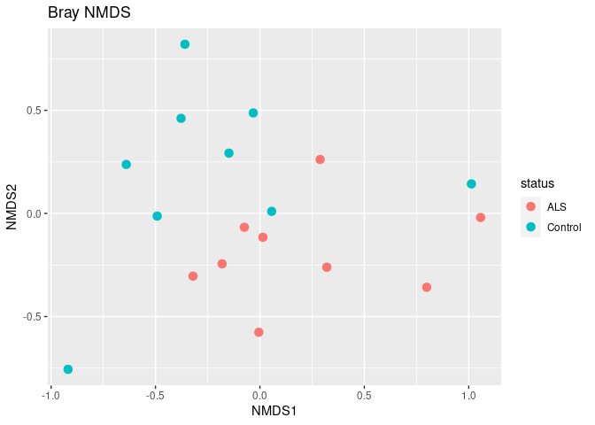
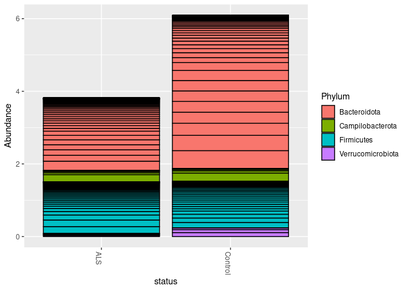

Microbiome of Amyotrophic Lateral Sclerosis (ALS) using 16S rRNA
================

<div align="center">


</div>

<div align="right">

<small>*Stephen Hawking*. Photo Credit: [NASA/Paul E.
Alers](https://flic.kr/p/6h1t6B).</small>

</div>

Amyotrophic lateral sclerosis
([ALS](https://en.wikipedia.org/wiki/Amyotrophic_lateral_sclerosis)) is
a neurodegenerative neuromuscular disease that results in the
progressive loss of motor neurons that control voluntary muscles.

About 20 genes have been shown to be associated with ALS, most
importantly [C9orf72](https://en.wikipedia.org/wiki/C9orf72), which
accounts for about 40% of the cases. In addition to genetic risk, other
environmental factors such as smoking, physical activitiy, represent
potential

The material in this lesson is based on [the DADA2
tutorial](https://benjjneb.github.io/dada2/tutorial.html)

``` r
library(tidyverse)
library(reshape2)
```

    ## 
    ## Attaching package: 'reshape2'

    ## The following object is masked from 'package:tidyr':
    ## 
    ##     smiths

``` r
library(digest)
home = "/projects/ALS/data"
```

# Dataset

| sample      | status  | pair |
|:------------|:--------|:-----|
| SRR10153499 | Control | 2    |
| SRR10153500 | ALS     | 3    |
| SRR10153502 | ALS     | 5    |
| SRR10153503 | ALS     | 2    |
| SRR10153504 | Control | 3    |
| SRR10153506 | ALS     | 9    |

``` r
summary(samples)
```

|     | sample           | status    | pair      |
|:----|:-----------------|:----------|:----------|
|     | Length:18        | ALS :9    | 1 :2      |
|     | Class :character | Control:9 | 2 :2      |
|     | Mode :character  | NA        | 3 :2      |
|     | NA               | NA        | 5 :2      |
|     | NA               | NA        | 6 :2      |
|     | NA               | NA        | 7 :2      |
|     | NA               | NA        | (Other):6 |

``` r
library(dada2)
```

    ## Loading required package: Rcpp

``` r
path = paste(home, "original", sep = "/")
list.files(path)
```

    ##  [1] "SRR10153499_1.fastq.gz" "SRR10153499_2.fastq.gz" "SRR10153500_1.fastq.gz"
    ##  [4] "SRR10153500_2.fastq.gz" "SRR10153501_1.fastq.gz" "SRR10153501_2.fastq.gz"
    ##  [7] "SRR10153502_1.fastq.gz" "SRR10153502_2.fastq.gz" "SRR10153503_1.fastq.gz"
    ## [10] "SRR10153503_2.fastq.gz" "SRR10153504_1.fastq.gz" "SRR10153504_2.fastq.gz"
    ## [13] "SRR10153505_1.fastq.gz" "SRR10153505_2.fastq.gz" "SRR10153506_1.fastq.gz"
    ## [16] "SRR10153506_2.fastq.gz" "SRR10153507_1.fastq.gz" "SRR10153507_2.fastq.gz"
    ## [19] "SRR10153508_1.fastq.gz" "SRR10153508_2.fastq.gz" "SRR10153509_1.fastq.gz"
    ## [22] "SRR10153509_2.fastq.gz" "SRR10153510_1.fastq.gz" "SRR10153510_2.fastq.gz"
    ## [25] "SRR10153511_1.fastq.gz" "SRR10153511_2.fastq.gz" "SRR10153512_1.fastq.gz"
    ## [28] "SRR10153512_2.fastq.gz" "SRR10153513_1.fastq.gz" "SRR10153513_2.fastq.gz"
    ## [31] "SRR10153514_1.fastq.gz" "SRR10153514_2.fastq.gz" "SRR10153515_1.fastq.gz"
    ## [34] "SRR10153515_2.fastq.gz" "SRR10153573_1.fastq.gz" "SRR10153573_2.fastq.gz"

``` r
fnFs <- sort(list.files(path, pattern="1.fastq.gz", full.names = TRUE))
head(fnFs)
```

    ## [1] "/projects/ALS/data/original/SRR10153499_1.fastq.gz"
    ## [2] "/projects/ALS/data/original/SRR10153500_1.fastq.gz"
    ## [3] "/projects/ALS/data/original/SRR10153501_1.fastq.gz"
    ## [4] "/projects/ALS/data/original/SRR10153502_1.fastq.gz"
    ## [5] "/projects/ALS/data/original/SRR10153503_1.fastq.gz"
    ## [6] "/projects/ALS/data/original/SRR10153504_1.fastq.gz"

``` r
fnRs <- sort(list.files(path, pattern="2.fastq.gz", full.names = TRUE))
head(fnRs)
```

    ## [1] "/projects/ALS/data/original/SRR10153499_2.fastq.gz"
    ## [2] "/projects/ALS/data/original/SRR10153500_2.fastq.gz"
    ## [3] "/projects/ALS/data/original/SRR10153501_2.fastq.gz"
    ## [4] "/projects/ALS/data/original/SRR10153502_2.fastq.gz"
    ## [5] "/projects/ALS/data/original/SRR10153503_2.fastq.gz"
    ## [6] "/projects/ALS/data/original/SRR10153504_2.fastq.gz"

``` r
sample.names <- sapply(strsplit(basename(fnFs), "_"), `[`, 1)
head(sample.names)
```

    ## [1] "SRR10153499" "SRR10153500" "SRR10153501" "SRR10153502" "SRR10153503"
    ## [6] "SRR10153504"

## Quality profile of the forward reads

``` r
plotQualityProfile(fnFs[1:2])
```

<!-- -->

## Quality profile of the reverse reads

``` r
plotQualityProfile(fnRs[1:2])
```

<!-- --> \#\# Filter and
trim

``` r
# Place filtered files in filtered/ sub-directory
filtFs <- file.path(home, "filtered", paste0(sample.names, ".1.filtered.fastq.gz"))
filtRs <- file.path(home, "filtered", paste0(sample.names, ".2.filtered.fastq.gz"))
names(filtFs) <- sample.names
names(filtRs) <- sample.names
```

``` r
out <- filterAndTrim(fnFs, filtFs, fnRs, filtRs, minLen=100, rm.phix = TRUE, multithread=TRUE) # On Windows set
head(out)
```

|                         | reads.in | reads.out |
|:------------------------|---------:|----------:|
| SRR10153499\_1.fastq.gz |    11688 |     11688 |
| SRR10153500\_1.fastq.gz |    15828 |     14203 |
| SRR10153501\_1.fastq.gz |    14180 |     14180 |
| SRR10153502\_1.fastq.gz |    10482 |     10482 |
| SRR10153503\_1.fastq.gz |    13782 |     13782 |
| SRR10153504\_1.fastq.gz |    14467 |     14467 |

## Learn the Error Rates

``` r
errF <- learnErrors(filtFs, multithread=TRUE)
```

    ## 53415457 total bases in 227501 reads from 18 samples will be used for learning the error rates.

``` r
errR <- learnErrors(filtRs, multithread=TRUE)
```

    ## 44820958 total bases in 227501 reads from 18 samples will be used for learning the error rates.

``` r
plotErrors(errF, nominalQ=TRUE)
```

    ## Warning: Transformation introduced infinite values in continuous y-axis

    ## Warning: Transformation introduced infinite values in continuous y-axis

<!-- -->

## Sample Inference

We are now ready to apply the core sample inference algorithm to the
filtered and trimmed sequence data.

``` r
dadaFs <- dada(filtFs, err=errF, multithread=TRUE)
```

    ## Sample 1 - 11688 reads in 5168 unique sequences.
    ## Sample 2 - 14203 reads in 8601 unique sequences.
    ## Sample 3 - 14180 reads in 7881 unique sequences.
    ## Sample 4 - 10482 reads in 5781 unique sequences.
    ## Sample 5 - 13782 reads in 6773 unique sequences.
    ## Sample 6 - 14467 reads in 8339 unique sequences.
    ## Sample 7 - 12705 reads in 6219 unique sequences.
    ## Sample 8 - 13557 reads in 6882 unique sequences.
    ## Sample 9 - 11403 reads in 6993 unique sequences.
    ## Sample 10 - 11681 reads in 5100 unique sequences.
    ## Sample 11 - 14304 reads in 7342 unique sequences.
    ## Sample 12 - 13186 reads in 7178 unique sequences.
    ## Sample 13 - 10621 reads in 5106 unique sequences.
    ## Sample 14 - 12542 reads in 5213 unique sequences.
    ## Sample 15 - 11066 reads in 7055 unique sequences.
    ## Sample 16 - 11063 reads in 6101 unique sequences.
    ## Sample 17 - 12525 reads in 4736 unique sequences.
    ## Sample 18 - 14046 reads in 7130 unique sequences.

``` r
dadaRs <- dada(filtRs, err=errR, multithread=TRUE)
```

    ## Sample 1 - 11688 reads in 7403 unique sequences.
    ## Sample 2 - 14203 reads in 10640 unique sequences.
    ## Sample 3 - 14180 reads in 10079 unique sequences.
    ## Sample 4 - 10482 reads in 7576 unique sequences.
    ## Sample 5 - 13782 reads in 9143 unique sequences.
    ## Sample 6 - 14467 reads in 10393 unique sequences.
    ## Sample 7 - 12705 reads in 8036 unique sequences.
    ## Sample 8 - 13557 reads in 9126 unique sequences.
    ## Sample 9 - 11403 reads in 8485 unique sequences.
    ## Sample 10 - 11681 reads in 7338 unique sequences.
    ## Sample 11 - 14304 reads in 9670 unique sequences.
    ## Sample 12 - 13186 reads in 9577 unique sequences.
    ## Sample 13 - 10621 reads in 7379 unique sequences.
    ## Sample 14 - 12542 reads in 7051 unique sequences.
    ## Sample 15 - 11066 reads in 8932 unique sequences.
    ## Sample 16 - 11063 reads in 7942 unique sequences.
    ## Sample 17 - 12525 reads in 6423 unique sequences.
    ## Sample 18 - 14046 reads in 9198 unique sequences.

## Inspecting the returned dada-class object:

``` r
dadaFs[[1]]
```

    ## dada-class: object describing DADA2 denoising results
    ## 65 sequence variants were inferred from 5168 input unique sequences.
    ## Key parameters: OMEGA_A = 1e-40, OMEGA_C = 1e-40, BAND_SIZE = 16

``` r
dadaRs[[1]]
```

    ## dada-class: object describing DADA2 denoising results
    ## 35 sequence variants were inferred from 7403 input unique sequences.
    ## Key parameters: OMEGA_A = 1e-40, OMEGA_C = 1e-40, BAND_SIZE = 16

## Merge paired reads

We now merge the forward and reverse reads together to obtain the full
denoised sequences. Merging is performed by aligning the denoised
forward reads with the reverse-complement of the corresponding denoised
reverse reads, and then constructing the merged “contig” sequences. By
default, merged sequences are only output if the forward and reverse
reads overlap by at least 12 bases, and are identical to each other in
the overlap region (but these conditions can be changed via function
arguments).

``` r
mergers <- mergePairs(dadaFs, filtFs, dadaRs, filtRs, verbose=TRUE)
```

    ## 9425 paired-reads (in 33 unique pairings) successfully merged out of 11337 (in 132 pairings) input.

    ## Duplicate sequences in merged output.

    ## 10731 paired-reads (in 61 unique pairings) successfully merged out of 13426 (in 443 pairings) input.

    ## 11277 paired-reads (in 55 unique pairings) successfully merged out of 13790 (in 311 pairings) input.

    ## 7178 paired-reads (in 30 unique pairings) successfully merged out of 10001 (in 313 pairings) input.

    ## Duplicate sequences in merged output.

    ## 9765 paired-reads (in 35 unique pairings) successfully merged out of 13262 (in 234 pairings) input.

    ## 11774 paired-reads (in 57 unique pairings) successfully merged out of 13940 (in 330 pairings) input.

    ## Duplicate sequences in merged output.

    ## 9410 paired-reads (in 36 unique pairings) successfully merged out of 12254 (in 295 pairings) input.

    ## 11103 paired-reads (in 42 unique pairings) successfully merged out of 13107 (in 203 pairings) input.

    ## 7864 paired-reads (in 37 unique pairings) successfully merged out of 10872 (in 357 pairings) input.

    ## 10052 paired-reads (in 36 unique pairings) successfully merged out of 11327 (in 175 pairings) input.

    ## Duplicate sequences in merged output.

    ## 10395 paired-reads (in 47 unique pairings) successfully merged out of 13599 (in 377 pairings) input.

    ## 11041 paired-reads (in 52 unique pairings) successfully merged out of 12556 (in 273 pairings) input.

    ## 8890 paired-reads (in 30 unique pairings) successfully merged out of 10190 (in 166 pairings) input.

    ## 11416 paired-reads (in 31 unique pairings) successfully merged out of 12346 (in 109 pairings) input.

    ## 7555 paired-reads (in 60 unique pairings) successfully merged out of 10113 (in 372 pairings) input.

    ## Duplicate sequences in merged output.

    ## 8214 paired-reads (in 35 unique pairings) successfully merged out of 10588 (in 226 pairings) input.

    ## Duplicate sequences in merged output.

    ## 10079 paired-reads (in 18 unique pairings) successfully merged out of 12309 (in 95 pairings) input.

    ## 11090 paired-reads (in 36 unique pairings) successfully merged out of 13562 (in 206 pairings) input.

    ## Duplicate sequences in merged output.

``` r
# Inspect the merger data.frame from the first sample
head(mergers[[1]])
```

| sequence                                                                                                                                                                                                                                                      | abundance | forward | reverse | nmatch | nmismatch | nindel | prefer | accept |
|:--------------------------------------------------------------------------------------------------------------------------------------------------------------------------------------------------------------------------------------------------------------|----------:|--------:|--------:|-------:|----------:|-------:|-------:|:-------|
| TACGGAAGGTCCGGGCGTTATCCGGATTTATTGGGTTTAAAGGGAGCGTAGGCTGTCTATTAAGCGTGTTGTGAAATTTACCGGCTCAACCGGTGGCTTGCAGCGCGAACTGGTCGACTTGAGTATGCAGGAAGTAGGCGGAATTCATGGTGTAGCGGTGAAATGCTTAGATATCATGACGAACTCCGATTGCGCAGGCAGCTTACTGTAGCATAACTGACGCTGATGCTCGAAAGTGCGGGTATCAAACAGG |      2916 |       1 |       1 |    247 |         0 |      0 |      1 | TRUE   |
| TACGGAAGGTTCGGGCGTTATCCGGATTTATTGGGTTTAAAGGGAGCGTAGGCCGTTTGGTAAGCGTGTTGTGAAATGTAGGAGCTCAACTTCTAGATTGCAGCGCGAACTGTCAGACTTGAGTGCGCACAACGTAGGCGGAATTCATGGTGTAGCGGTGAAATGCTTAGATATCATGAAGAACTCCGATTGCGAAGGCAGCTTACGGGAGCGCAACTGACGCTGAAGCTCGAAGGTGCGGGTATCGAACAGG |      1077 |       3 |       2 |    247 |         0 |      0 |      1 | TRUE   |
| TACAGAGGTCTCAAGCGTTGTTCGGAATCACTGGGCGTAAAGCGTGCGTAGGCTGTTTCGTAAGTCGTGTGTGAAAGGCGCGGGCTCAACCCGCGGACGGCACATGATACTGCGAGACTAGAGTAATGGAGGGGGAACCGGAATTCTCGGTGTAGCAGTGAAATGCGTAGATATCGAGAGGAACACTCGTGGCGAAGGCGGGTTCCTGGACATTAACTGACGCTGAGGCACGAAGGCCAGGGGAGCGAAAGGG |       976 |       2 |       3 |    193 |         0 |      0 |      2 | TRUE   |
| TACGGAAGGTTCGGGCGTTATCCGGATTTATTGGGTTTAAAGGGAGCGTAGGCCGTTTGGTAAGCGTGTTGTGAAATGTAGTAGCTCAACTTCTAGATTGCAGCGCGAACTGTCAGACTTGAGTGCGCACAACGTAGGCGGAATTCATGGTGTAGCGGTGAAATGCTTAGATATCATGAAGAACTCCGATTGCGAAGGCAGCTTACGGGAGCGCAACTGACGCTGAAGCTCGAAGGTGCGGGTATCGAACAGG |       669 |       4 |      32 |    247 |         0 |      0 |      1 | TRUE   |
| TACGTATGGAGCGAGCGTTGTCCGGAATTATTGGGCGTAAAGGGTACGCAGGCGGTTTAATAAGTCGAATGTTAAAGATCGGGGCTCAACCCCGTAAAGCATTGGAAACTGATAAACTTGAGTAGTGGAGAGGAAAGTGGAATTCCTAGTGTAGTGGTGAAATACGTAGATATTAGGAGGAATACCAGTAGCGAAGGCGACTTTCTGGACACAAACTGACGCTGAGGTACGAAAGCGTGGGGAGCAAACAGG  |       463 |       6 |       5 |    250 |         0 |      0 |      2 | TRUE   |
| TACGGAAGGTCCGGGCGTTATCCGGATTTATTGGGTTTAAAGGGAGCGTAGGCTGTCTATTAAGCGTGTTGTGAAATATACCGGCTCAACCGGTGGCTTGCAGCGCGAACTGGTCGACTTGAGTATGCAGGAAGTAGGCGGAATTCATGGTGTAGCGGTGAAATGCTTAGATATCATGACGAACTCCGATTGCGCAGGCAGCTTACTGTAGCATAACTGACGCTGATGCTCGAAAGTGCGGGTATCAAACAGG |       439 |       5 |      34 |    247 |         0 |      0 |      1 | TRUE   |

The `mergers` object is a list of data.frames from each sample. Each
data.frame contains the merged $sequence, its
$abundance, and the indices of the \`$forward`and`$reverse`sequence variants that were merged. Paired reads that did not exactly overlap were removed by`mergePairs\`,
further reducing spurious output.

## Construct sequence table

We can now construct an amplicon sequence variant table (ASV) table, a
higher-resolution version of the OTU table produced by traditional
methods.

``` r
seqtab <- makeSequenceTable(mergers)
```

    ## Duplicate sequences detected and merged.
    ## Duplicate sequences detected and merged.
    ## Duplicate sequences detected and merged.
    ## Duplicate sequences detected and merged.
    ## Duplicate sequences detected and merged.
    ## Duplicate sequences detected and merged.
    ## Duplicate sequences detected and merged.

``` r
dim(seqtab)
```

    ## [1]  18 293

``` r
# Inspect distribution of sequence lengths
table(nchar(getSequences(seqtab)))
```

| 252 | 253 | 254 |
|----:|----:|----:|
|  56 | 229 |   8 |

The sequence table is a `matrix` with rows corresponding to (and named
by) the samples, and columns corresponding to (and named by) the
sequence variants. This table contains 293 ASVs, and the lengths of our
merged sequences all fall within the expected range for this V4
amplicon.

*Considerations for your own data:* Sequences that are much longer or
shorter than expected may be the result of non-specific priming. You can
remove non-target-length sequences from your sequence table (eg.
`seqtab2 <- seqtab[,nchar(colnames(seqtab)) %in% 250:256]`). This is
analogous to “cutting a band” in-silico to get amplicons of the targeted
length.

## Remove chimeras

The core `dada` method corrects substitution and indel errors, but
chimeras remain. Fortunately, the accuracy of sequence variants after
denoising makes identifying chimeric ASVs simpler than when dealing with
fuzzy OTUs. Chimeric sequences are identified if they can be exactly
reconstructed by combining a left-segment and a right-segment from two
more abundant “parent” sequences.

``` r
seqtab.nochim <- removeBimeraDenovo(seqtab, method="consensus", multithread=TRUE, verbose=TRUE)
```

    ## Identified 21 bimeras out of 293 input sequences.

``` r
dim(seqtab.nochim)
```

    ## [1]  18 272

``` r
sum(seqtab.nochim)/sum(seqtab)
```

    ## [1] 0.9872108

The frequency of chimeric sequences varies substantially from dataset to
dataset, and depends on on factors including experimental procedures and
sample complexity. Here chimeras make up about 21% of the merged
sequence variants, but when we account for the abundances of those
variants we see they account for only about 4% of the merged sequence
reads.

*Considerations for your own data:* Most of your reads should remain
after chimera removal (it is not uncommon for a majority of sequence
variants to be removed though). If most of your reads were removed as
chimeric, upstream processing may need to be revisited. In almost all
cases this is caused by primer sequences with ambiguous nucleotides that
were not removed prior to beginning the DADA2 pipeline.

## Track reads through the pipeline

As a final check of our progress, we’ll look at the number of reads that
made it through each step in the pipeline:

``` r
getN <- function(x) sum(getUniques(x))
track <- cbind(out, sapply(dadaFs, getN), sapply(dadaRs, getN), sapply(mergers, getN), rowSums(seqtab.nochim))
```

    ## Duplicate sequences detected and merged.
    ## Duplicate sequences detected and merged.
    ## Duplicate sequences detected and merged.
    ## Duplicate sequences detected and merged.
    ## Duplicate sequences detected and merged.
    ## Duplicate sequences detected and merged.
    ## Duplicate sequences detected and merged.

``` r
# If processing a single sample, remove the sapply calls: e.g. replace sapply(dadaFs, getN) with getN(dadaFs)
colnames(track) <- c("input", "filtered", "denoisedF", "denoisedR", "merged", "nonchim")
rownames(track) <- sample.names
head(track)
```

|             | input | filtered | denoisedF | denoisedR | merged | nonchim |
|:------------|------:|---------:|----------:|----------:|-------:|--------:|
| SRR10153499 | 11688 |    11688 |     11443 |     11492 |   9425 |    9425 |
| SRR10153500 | 15828 |    14203 |     13676 |     13833 |  10731 |   10711 |
| SRR10153501 | 14180 |    14180 |     13951 |     13964 |  11277 |   11277 |
| SRR10153502 | 10482 |    10482 |     10134 |     10260 |   7178 |    7111 |
| SRR10153503 | 13782 |    13782 |     13448 |     13486 |   9765 |    9713 |
| SRR10153504 | 14467 |    14467 |     14093 |     14204 |  11774 |   11774 |

Looks good! We kept the majority of our raw reads, and there is no
over-large drop associated with any single step.

*Considerations for your own data:* This is a great place to do a last
**sanity check**. Outside of filtering, there should no step in which a
majority of reads are lost. If a majority of reads failed to merge, you
may need to revisit the `truncLen` parameter used in the filtering step
and make sure that the truncated reads span your amplicon. If a majority
of reads were removed as chimeric, you may need to revisit the removal
of primers, as the ambiguous nucleotides in unremoved primers interfere
with chimera identification.

# Taxonomic Classification

## Assign taxonomy

It is common at this point, especially in 16S/18S/ITS amplicon
sequencing, to assign taxonomy to the sequence variants. The DADA2
package provides a native implementation of the [naive Bayesian
classifier method](http://www.ncbi.nlm.nih.gov/pubmed/17586664) for this
purpose. The `assignTaxonomy` function takes as input a set of sequences
to be classified and a training set of reference sequences with known
taxonomy, and outputs taxonomic assignments with at least `minBoot`
bootstrap confidence.

We maintain [formatted training fastas for the RDP training set,
GreenGenes clustered at 97% identity, and the Silva reference
database](https://benjjneb.github.io/dada2/training.html), and
additional trainings fastas suitable for protists and certain specific
environments have been contributed. For fungal taxonomy, the General
Fasta release files from the [UNITE ITS
database](https://unite.ut.ee/repository.php) can be used as is. To
follow along, download the `silva_nr_v138_train_set.fa.gz` file, and
place it in the directory with the fastq files.

``` r
silva_home = paste (home, "silva", sep = "/")
silva_home
```

    ## [1] "/projects/ALS/data/silva"

``` r
taxa <- assignTaxonomy(seqtab.nochim, paste(silva_home, "silva_nr99_v138_train_set.fa.gz", sep = "/"), multithread=TRUE)
head(taxa)
```

|                                                                                                                                                                                                                                                               | Kingdom  | Phylum           | Class           | Order                               | Family             | Genus         |
|:--------------------------------------------------------------------------------------------------------------------------------------------------------------------------------------------------------------------------------------------------------------|:---------|:-----------------|:----------------|:------------------------------------|:-------------------|:--------------|
| TACGGAAGGTCCGGGCGTTATCCGGATTTATTGGGTTTAAAGGGAGTGTAGGCGGCCTGTTAAGCGTGTTGTGAAATGTAGATGCTCAACATCTGAACTGCAGCGCGAACTGGCTGGCTTGAGTACACGCAACGTGGGCGGAATTCATGGTGTAGCGGTGAAATGCTTAGATATCATGAGGAACTCCTATTGCGAAGGCAGCTCACGGGAGTGTCACTGACGCTTAAGCTCGAAGGTGCGGGTATCAAACAGG | Bacteria | Bacteroidota     | Bacteroidia     | Bacteroidales                       | Prevotellaceae     | Prevotella    |
| TACGGAAGGTTCGGGCGTTATCCGGATTTATTGGGTTTAAAGGGAGCGTAGGCCGTTTGGTAAGCGTGTTGTGAAATGTAGGAGCTCAACTTCTAGATTGCAGCGCGAACTGTCAGACTTGAGTGCGCACAACGTAGGCGGAATTCATGGTGTAGCGGTGAAATGCTTAGATATCATGAAGAACTCCGATTGCGAAGGCAGCTTACGGGAGCGCAACTGACGCTGAAGCTCGAAGGTGCGGGTATCGAACAGG | Bacteria | Bacteroidota     | Bacteroidia     | Bacteroidales                       | Prevotellaceae     | Prevotella    |
| TACGTATGGAGCGAGCGTTGTCCGGAATTATTGGGCGTAAAGGGTACGCAGGCGGTTTAATAAGTCGAATGTTAAAGATCGGGGCTCAACCCCGTAAAGCATTGGAAACTGATAAACTTGAGTAGTGGAGAGGAAAGTGGAATTCCTAGTGTAGTGGTGAAATACGTAGATATTAGGAGGAATACCAGTAGCGAAGGCGACTTTCTGGACACAAACTGACGCTGAGGTACGAAAGCGTGGGGAGCAAACAGG  | Bacteria | Firmicutes       | Clostridia      | Peptostreptococcales-Tissierellales | Finegoldia         | NA            |
| TACGGAAGGTCCAGGCGTTATCCGGATTTATTGGGTTTAAAGGGAGTGTAGGCGGTTGGTTAAGCGTGTTGTGAAATGTAGATGCTCAACATCTGACTTGCAGCGCGAACTGGCTGACTTGAGTACACACAACGTAGGCGGAATTCATGGTGTAGCGGTGAAATGCTTAGATATCATGAAGAACTCCGATTGCGAAGGCAGCTTACGGGAGTGTTACTGACGCTTAAGCTCGAAGGTGCGGGTATCGAACAGG | Bacteria | Bacteroidota     | Bacteroidia     | Bacteroidales                       | Prevotellaceae     | Prevotella    |
| TACGTAAGGGGCGAGCGTTGTCCGGAATTATTGGGCGTAAAGAGTGCGTAGGCGGCAAATTAAGTCAGATGTGAAAACTAAGGGCTCAACCCATAGATTGCATCTGAAACTGATATGCTTGAGTCAAGGAGAGGAAAGTGGAATTCCTAGTGTAGCGGTGGAATGCGTAGATATTAGGAGGAATACCGGTGGCGAAGGCGACTTTCTGGACTTGAACTGACGCTGAGGCACGAAAGCGTGGGGAGCAAACAGG | Bacteria | Firmicutes       | Clostridia      | Peptostreptococcales-Tissierellales | Fenollaria         | NA            |
| TACGGAGGGTGCAAGCGTTACTCGGAATCACTGGGCGTAAAGGGTGCGTAGGTGGATTATCAAGTCTCTTGTGAAATCTAATAGCTTAACTATTAAATTGCTTGGGAAACTGATAGTCTAGAGTAGGGGAGAGGCAGATGGAACTCTTGGTGTAGGAGTAAAATCCGTAGATATCAAGAAGAATACCTATTGCGAAAGCGATCTGCTAGAACCTAACTGACACTGATGCACGAAAGCGTGGGGAGCAAACAGG | Bacteria | Campilobacterota | Campylobacteria | Campylobacterales                   | Campylobacteraceae | Campylobacter |

*Extensions*: The dada2 package also implements a method to make
[species level assignments based on exact
matching](https://benjjneb.github.io/dada2/assign.html#species-assignment)
between ASVs and sequenced reference strains. Recent analysis suggests
that [exact matching (or 100% identity) is the only appropriate way to
assign species to 16S gene
fragments](https://academic.oup.com/bioinformatics/advance-article-abstract/doi/10.1093/bioinformatics/bty113/4913809).
Currently, [species-assignment training fastas are available for the
Silva and RDP 16S
databases](https://benjjneb.github.io/dada2/training.html). To follow
the optional species addition step, download the
`silva_species_assignment_v138.fa.gz` file, and place it in the
directory with the fastq files.

``` r
taxa <- addSpecies(taxa, paste(silva_home, "silva_species_assignment_v138.fa.gz", sep = "/"))
head(taxa)
```

|                                                                                                                                                                                                                                                               | Kingdom  | Phylum           | Class           | Order                               | Family             | Genus         | Species  |
|:--------------------------------------------------------------------------------------------------------------------------------------------------------------------------------------------------------------------------------------------------------------|:---------|:-----------------|:----------------|:------------------------------------|:-------------------|:--------------|:---------|
| TACGGAAGGTCCGGGCGTTATCCGGATTTATTGGGTTTAAAGGGAGTGTAGGCGGCCTGTTAAGCGTGTTGTGAAATGTAGATGCTCAACATCTGAACTGCAGCGCGAACTGGCTGGCTTGAGTACACGCAACGTGGGCGGAATTCATGGTGTAGCGGTGAAATGCTTAGATATCATGAGGAACTCCTATTGCGAAGGCAGCTCACGGGAGTGTCACTGACGCTTAAGCTCGAAGGTGCGGGTATCAAACAGG | Bacteria | Bacteroidota     | Bacteroidia     | Bacteroidales                       | Prevotellaceae     | Prevotella    | corporis |
| TACGGAAGGTTCGGGCGTTATCCGGATTTATTGGGTTTAAAGGGAGCGTAGGCCGTTTGGTAAGCGTGTTGTGAAATGTAGGAGCTCAACTTCTAGATTGCAGCGCGAACTGTCAGACTTGAGTGCGCACAACGTAGGCGGAATTCATGGTGTAGCGGTGAAATGCTTAGATATCATGAAGAACTCCGATTGCGAAGGCAGCTTACGGGAGCGCAACTGACGCTGAAGCTCGAAGGTGCGGGTATCGAACAGG | Bacteria | Bacteroidota     | Bacteroidia     | Bacteroidales                       | Prevotellaceae     | Prevotella    | NA       |
| TACGTATGGAGCGAGCGTTGTCCGGAATTATTGGGCGTAAAGGGTACGCAGGCGGTTTAATAAGTCGAATGTTAAAGATCGGGGCTCAACCCCGTAAAGCATTGGAAACTGATAAACTTGAGTAGTGGAGAGGAAAGTGGAATTCCTAGTGTAGTGGTGAAATACGTAGATATTAGGAGGAATACCAGTAGCGAAGGCGACTTTCTGGACACAAACTGACGCTGAGGTACGAAAGCGTGGGGAGCAAACAGG  | Bacteria | Firmicutes       | Clostridia      | Peptostreptococcales-Tissierellales | Finegoldia         | NA            | NA       |
| TACGGAAGGTCCAGGCGTTATCCGGATTTATTGGGTTTAAAGGGAGTGTAGGCGGTTGGTTAAGCGTGTTGTGAAATGTAGATGCTCAACATCTGACTTGCAGCGCGAACTGGCTGACTTGAGTACACACAACGTAGGCGGAATTCATGGTGTAGCGGTGAAATGCTTAGATATCATGAAGAACTCCGATTGCGAAGGCAGCTTACGGGAGTGTTACTGACGCTTAAGCTCGAAGGTGCGGGTATCGAACAGG | Bacteria | Bacteroidota     | Bacteroidia     | Bacteroidales                       | Prevotellaceae     | Prevotella    | disiens  |
| TACGTAAGGGGCGAGCGTTGTCCGGAATTATTGGGCGTAAAGAGTGCGTAGGCGGCAAATTAAGTCAGATGTGAAAACTAAGGGCTCAACCCATAGATTGCATCTGAAACTGATATGCTTGAGTCAAGGAGAGGAAAGTGGAATTCCTAGTGTAGCGGTGGAATGCGTAGATATTAGGAGGAATACCGGTGGCGAAGGCGACTTTCTGGACTTGAACTGACGCTGAGGCACGAAAGCGTGGGGAGCAAACAGG | Bacteria | Firmicutes       | Clostridia      | Peptostreptococcales-Tissierellales | Fenollaria         | NA            | NA       |
| TACGGAGGGTGCAAGCGTTACTCGGAATCACTGGGCGTAAAGGGTGCGTAGGTGGATTATCAAGTCTCTTGTGAAATCTAATAGCTTAACTATTAAATTGCTTGGGAAACTGATAGTCTAGAGTAGGGGAGAGGCAGATGGAACTCTTGGTGTAGGAGTAAAATCCGTAGATATCAAGAAGAATACCTATTGCGAAAGCGATCTGCTAGAACCTAACTGACACTGATGCACGAAAGCGTGGGGAGCAAACAGG | Bacteria | Campilobacterota | Campylobacteria | Campylobacterales                   | Campylobacteraceae | Campylobacter | hominis  |

``` r
md5 = lapply(colnames(seqtab.nochim), digest)
colnames(seqtab.nochim) = md5

otus = as.matrix(seqtab.nochim)
colnames(otus) = md5
otus[1:5, 1:5]
```

|             | 023d4737baa910a431f2ddb5de0e44c8 | 6075c62942cb38859a92dd48a72a3885 | 504fb0a312e04e43d371acb19a95d789 | 6619cbcb3bcaafe1e418ad7b9073af70 | 977091fc9d08b0b43c99857ca9976e72 |
|:------------|---------------------------------:|---------------------------------:|---------------------------------:|---------------------------------:|---------------------------------:|
| SRR10153499 |                                0 |                             1077 |                              463 |                                0 |                                0 |
| SRR10153500 |                              460 |                                0 |                              580 |                                0 |                              331 |
| SRR10153501 |                                0 |                              140 |                             2028 |                                0 |                              123 |
| SRR10153502 |                                0 |                                0 |                                0 |                                0 |                                0 |
| SRR10153503 |                                0 |                                0 |                              296 |                                0 |                             1234 |

``` r
rownames(taxa) = lapply(rownames(taxa), digest)
head(taxa)
```

|                                  | Kingdom  | Phylum           | Class           | Order                               | Family             | Genus         | Species  |
|:---------------------------------|:---------|:-----------------|:----------------|:------------------------------------|:-------------------|:--------------|:---------|
| 023d4737baa910a431f2ddb5de0e44c8 | Bacteria | Bacteroidota     | Bacteroidia     | Bacteroidales                       | Prevotellaceae     | Prevotella    | corporis |
| 6075c62942cb38859a92dd48a72a3885 | Bacteria | Bacteroidota     | Bacteroidia     | Bacteroidales                       | Prevotellaceae     | Prevotella    | NA       |
| 504fb0a312e04e43d371acb19a95d789 | Bacteria | Firmicutes       | Clostridia      | Peptostreptococcales-Tissierellales | Finegoldia         | NA            | NA       |
| 6619cbcb3bcaafe1e418ad7b9073af70 | Bacteria | Bacteroidota     | Bacteroidia     | Bacteroidales                       | Prevotellaceae     | Prevotella    | disiens  |
| 977091fc9d08b0b43c99857ca9976e72 | Bacteria | Firmicutes       | Clostridia      | Peptostreptococcales-Tissierellales | Fenollaria         | NA            | NA       |
| e41846b638aa4b7eb2728408abf3700b | Bacteria | Campilobacterota | Campylobacteria | Campylobacterales                   | Campylobacteraceae | Campylobacter | hominis  |

Let’s inspect the taxonomic assignments:

``` r
taxa.print <- taxa # Removing sequence rownames for display only
rownames(taxa.print) <- NULL
head(taxa.print)
```

| Kingdom  | Phylum           | Class           | Order                               | Family             | Genus         | Species  |
|:---------|:-----------------|:----------------|:------------------------------------|:-------------------|:--------------|:---------|
| Bacteria | Bacteroidota     | Bacteroidia     | Bacteroidales                       | Prevotellaceae     | Prevotella    | corporis |
| Bacteria | Bacteroidota     | Bacteroidia     | Bacteroidales                       | Prevotellaceae     | Prevotella    | NA       |
| Bacteria | Firmicutes       | Clostridia      | Peptostreptococcales-Tissierellales | Finegoldia         | NA            | NA       |
| Bacteria | Bacteroidota     | Bacteroidia     | Bacteroidales                       | Prevotellaceae     | Prevotella    | disiens  |
| Bacteria | Firmicutes       | Clostridia      | Peptostreptococcales-Tissierellales | Fenollaria         | NA            | NA       |
| Bacteria | Campilobacterota | Campylobacteria | Campylobacterales                   | Campylobacteraceae | Campylobacter | hominis  |

Unsurprisingly, the Bacteroidetes are well represented among the most
abundant taxa in these fecal samples. Few species assignments were made,
both because it is often not possible to make unambiguous species
assignments from subsegments of the 16S gene, and because there is
surprisingly little coverage of the indigenous mouse gut microbiota in
reference databases.

*Considerations for your own data:* If your reads do not seem to be
appropriately assigned, for example lots of your bacterial 16S sequences
are being assigned as `Eukaryota NA NA NA NA NA`, your reads may be in
the opposite orientation as the reference database. Tell dada2 to try
the reverse-complement orientation with
`assignTaxonomy(..., tryRC=TRUE)` and see if this fixes the assignments.
If using DECIPHER for taxonomy, try `IdTaxa (..., strand="both")`.

# Handoff to phyloseq

The phyloseq R package is a powerful framework for further analysis of
microbiome data. We now demonstrate how to straightforwardly import the
tables produced by the DADA2 pipeline into phyloseq. We’ll also add the
small amount of metadata we have – the samples are named by the gender
(G), mouse subject number (X) and the day post-weaning (Y) it was
sampled (eg. GXDY).

``` r
library("phyloseq")
```

## Import into phyloseq:

We can construct a simple sample data.frame from the information encoded
in the filenames. Usually this step would instead involve reading the
sample data in from a file.

``` r
samples = as.data.frame(samples)
row.names(samples) = samples$sample
samples
```

|             | sample      | status  | pair |
|:------------|:------------|:--------|:-----|
| SRR10153499 | SRR10153499 | Control | 2    |
| SRR10153500 | SRR10153500 | ALS     | 3    |
| SRR10153502 | SRR10153502 | ALS     | 5    |
| SRR10153503 | SRR10153503 | ALS     | 2    |
| SRR10153504 | SRR10153504 | Control | 3    |
| SRR10153506 | SRR10153506 | ALS     | 9    |
| SRR10153508 | SRR10153508 | Control | 8    |
| SRR10153510 | SRR10153510 | ALS     | 8    |
| SRR10153512 | SRR10153512 | Control | 7    |
| SRR10153514 | SRR10153514 | Control | 6    |
| SRR10153501 | SRR10153501 | ALS     | 1    |
| SRR10153505 | SRR10153505 | Control | 5    |
| SRR10153507 | SRR10153507 | ALS     | 7    |
| SRR10153509 | SRR10153509 | ALS     | 6    |
| SRR10153511 | SRR10153511 | Control | 1    |
| SRR10153513 | SRR10153513 | ALS     | 10   |
| SRR10153515 | SRR10153515 | Control | 9    |
| SRR10153573 | SRR10153573 | Control | 10   |

We now construct a phyloseq object directly from the dada2 outputs.

``` r
ps = phyloseq(otu_table(seqtab.nochim, taxa_are_rows=FALSE),  sample_data(samples),  tax_table(taxa))
ps
```

    ## phyloseq-class experiment-level object
    ## otu_table()   OTU Table:         [ 272 taxa and 18 samples ]
    ## sample_data() Sample Data:       [ 18 samples by 3 sample variables ]
    ## tax_table()   Taxonomy Table:    [ 272 taxa by 7 taxonomic ranks ]

We are now ready to use phyloseq!

Visualize alpha-diversity:

``` r
plot_richness(ps, x="status", measures=c("Shannon", "Simpson"), color = "pair")
```

    ## Warning in estimate_richness(physeq, split = TRUE, measures = measures): The data you have provided does not have
    ## any singletons. This is highly suspicious. Results of richness
    ## estimates (for example) are probably unreliable, or wrong, if you have already
    ## trimmed low-abundance taxa from the data.
    ## 
    ## We recommended that you find the un-trimmed data and retry.

<!-- -->

No obvious systematic difference in alpha-diversity between early and
late samples.

``` r
ps_rank = transform_sample_counts(ps, threshrankfun(50))
ps_log = transform_sample_counts(ps, log)
ps_norm = transform_sample_counts(ps, function(x) x / sum(x))
```

Ordinate: Transform data to proportions as appropriate for Bray-Curtis
distances

``` r
ord.nmds.bray <- ordinate(ps_norm, method="NMDS", distance="bray")
```

    ## Run 0 stress 0.1924555 
    ## Run 1 stress 0.2113415 
    ## Run 2 stress 0.1923341 
    ## ... New best solution
    ## ... Procrustes: rmse 0.1307818  max resid 0.3105953 
    ## Run 3 stress 0.182357 
    ## ... New best solution
    ## ... Procrustes: rmse 0.1664538  max resid 0.375834 
    ## Run 4 stress 0.171294 
    ## ... New best solution
    ## ... Procrustes: rmse 0.09671362  max resid 0.2768075 
    ## Run 5 stress 0.1712941 
    ## ... Procrustes: rmse 0.0004004293  max resid 0.001386297 
    ## ... Similar to previous best
    ## Run 6 stress 0.1730987 
    ## Run 7 stress 0.1924555 
    ## Run 8 stress 0.1712943 
    ## ... Procrustes: rmse 0.0004997427  max resid 0.001731287 
    ## ... Similar to previous best
    ## Run 9 stress 0.2001594 
    ## Run 10 stress 0.1712945 
    ## ... Procrustes: rmse 0.0006229447  max resid 0.002157385 
    ## ... Similar to previous best
    ## Run 11 stress 0.1838543 
    ## Run 12 stress 0.2041785 
    ## Run 13 stress 0.2037715 
    ## Run 14 stress 0.1850295 
    ## Run 15 stress 0.1976837 
    ## Run 16 stress 0.1917947 
    ## Run 17 stress 0.3719197 
    ## Run 18 stress 0.1712953 
    ## ... Procrustes: rmse 0.0008758067  max resid 0.003023242 
    ## ... Similar to previous best
    ## Run 19 stress 0.1712942 
    ## ... Procrustes: rmse 0.0003932372  max resid 0.001359396 
    ## ... Similar to previous best
    ## Run 20 stress 0.1752297 
    ## *** Solution reached

``` r
plot_ordination(ps, ord.nmds.bray, color="status", title="Bray NMDS") + geom_point(size = 3)
```

<!-- -->

Ordination picks out a clear separation between the early and late
samples.

## Bar plot

``` r
ps
```

    ## phyloseq-class experiment-level object
    ## otu_table()   OTU Table:         [ 272 taxa and 18 samples ]
    ## sample_data() Sample Data:       [ 18 samples by 3 sample variables ]
    ## tax_table()   Taxonomy Table:    [ 272 taxa by 7 taxonomic ranks ]

``` r
ps_norm  = transform_sample_counts(ps, function(x) x / sum(x) )
ps_filtered = filter_taxa(ps_norm, function(x) mean(x) > 1e-3, prune = TRUE)
ps_filtered
```

    ## phyloseq-class experiment-level object
    ## otu_table()   OTU Table:         [ 129 taxa and 18 samples ]
    ## sample_data() Sample Data:       [ 18 samples by 3 sample variables ]
    ## tax_table()   Taxonomy Table:    [ 129 taxa by 7 taxonomic ranks ]

``` r
plot_bar(ps_filtered, x="status", fill="Phylum") + geom_bar(aes(fill=Phylum), stat="identity", position="stack", color = "white")
```

<!-- -->

``` r
plot_bar(ps_norm, x="status", fill="Phylum")
```

<!-- -->

Normalize number of reads in each sample using median sequencing depth.

``` r
total = median(sample_sums(ps))
standf = function(x, t=total) round(t * (x / sum(x)))
ps2 = transform_sample_counts(ps, standf)
ps2
```

    ## phyloseq-class experiment-level object
    ## otu_table()   OTU Table:         [ 272 taxa and 18 samples ]
    ## sample_data() Sample Data:       [ 18 samples by 3 sample variables ]
    ## tax_table()   Taxonomy Table:    [ 272 taxa by 7 taxonomic ranks ]

``` r
top20 <- names(sort(taxa_sums(ps), decreasing=TRUE))[1:20]
ps.top20 <- transform_sample_counts(ps, function(OTU) OTU/sum(OTU))
ps.top20 <- prune_taxa(top20, ps.top20)

plot_bar(ps.top20, x="status", fill="Phylum")
```

<!-- -->
